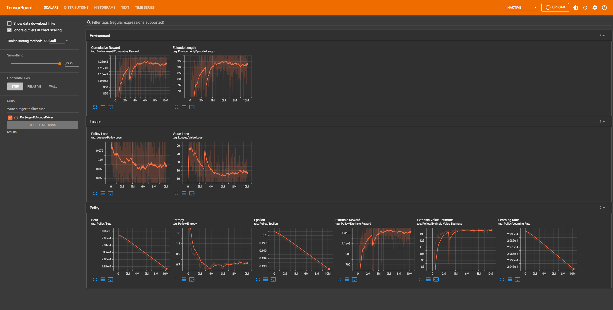

# Karting Microgame "Player vs AI" (Unity)
A racing-game with the AI.

### [PLAY](https://play.unity.com/mg/karting/build-tf1)

## Unity Learn Project
This is a mod-project of Unity learning karting-template
- [Karting Microgame](https://learn.unity.com/project/karting-template)
- [ML-Agents](https://github.com/Unity-Technologies/ml-agents)

## Deep Reinforcement Learning
- Algorithm: PPO (proximal policy optimization)
- Steps: 6.999064M
- Penalty & Reward: Hit>Checkpoint>Speed>Brake

## Preview

